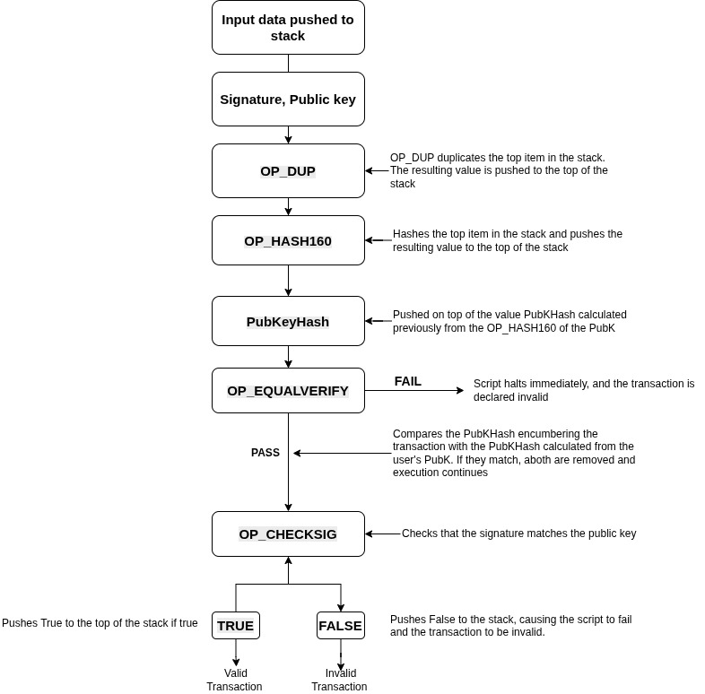

[](https://classroom.github.com/a/1neRm4kC)
# assignment-4
Bitcoin Scripting


# Assignment A

## Given Script:

```

OP_DUP OP_HASH160 <PubKeyHash> OP_EQUALVERIFY OP_CHECKSIG
```


---

## Tasks

### 1. Break down each opcode's purpose
- **OP_DUP:** Pushes a copy of the  topmost stack item onto the stack.  
- **OP_HASH160:** Consumes the topmost item on the stack, computes the `RIPEMD160(SHA256())` hash of that item, and pushes that hash onto the stack.  
- **OP_EQUALVERIFY:** Runs `OP_EQUAL` and then `OP_VERIFY` in sequence.  
- **OP_CHECKSIG:** Consumes a signature and a full public key, and pushes `true` onto the stack if the transaction data specified by the `SIGHASH` flag was converted into the signature using the same ECDSA private key that generated the public key. Otherwise, it pushes `false` onto the stack.  

---

### 2. Create a diagram showing data flow



---

### 3. Identify what happens if signature verification fails
`OP_CHECKSIG` pushes `false` onto the stack, causing the transaction validation to fail and the output to remain unspent.

---

### 4. Explain the security benefits of hash verification
Hash verification ensures that only the rightful owner of the private key corresponding to the hashed public key can spend the output, preventing unauthorized access and improving transaction security.This process ensures security, trust, and operational efficiency in the blockchain network, making it an essential element in Bitcoin transactions and mining.


# Assignment B

Implement a Hashed Time-Lock Contract for atomic swap between Alice and Bob:

Alice can claim with secret preimage within 21 minutes

Bob gets refund after 21 minutes

Tasks:

Complete the HTLC script

Create claiming transaction script

Create refund transaction script

Test with sample hash and timeout
